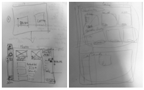
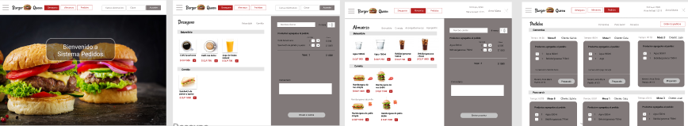
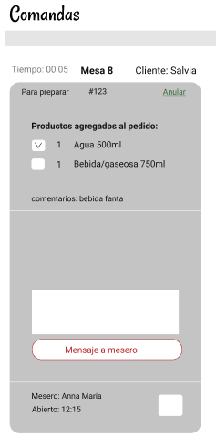
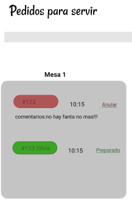
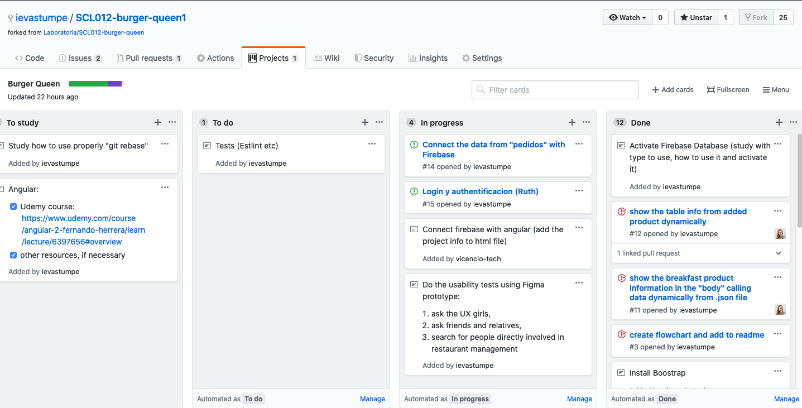

# SCL012BurgerQueen

## Objetivo del proyecto

## Flujo

## Historias de usuario
1. Mesero/a debe poder tomar pedido de cliente
>_“Yo como meserx quiero tomar el pedido de un cliente para no depender de mi mala memoria, para saber cuánto cobrar, y enviarlo a la cocina para evitar errores y que se puedan ir preparando en orden.“_

2. Jefe de cocina debe ver los pedidos
>_“Yo como jefx de cocina quiero ver los pedidos de los clientes en orden y marcar cuáles están listos para saber qué se debe cocinar y avisar a lxs meserxs que un pedido está listo para servirlo a un cliente”_

3. Meserx debe ver pedidos listos para servir
>_“Yo como meserx quiero ver los pedidos que están preparados para entregarlos rápidamente a los clientes que las hicieron.“_

## Diseño

### Prototipo de baja fidelidad

### Prototipo de alta fidelidad

Accesso al prototipo en plataforma de Figma [aquí](https://www.figma.com/file/H6Rvl4NQQsPHM1SynEv75A/Untitled?node-id=0%3A1).
Después de tests de usabilidad con prototipo y cambios en el equipo de desarrollo, editamos el diseño para mejorar el producto final.

Los cambios hechos son:
* distintos colores de precio - El color verde del precio del producto significaría que el producto está disponible, rojo > que el restaurante no lo tiene. Así el mesero podría reaccionar más fácilmente y saber si hay algún producto que no puede ofrecer a los clientes de restaurante

* diseño de comandas - mejoramos el diseño del pedido enviado a cocina, agregando la posibilidad de incluir comentario/mensaje por parte de cocinero antes de marcar que el pedido está preparado.

    

* pedidos para servir - agregamos distintos colores de pedidos por la mesa. El color verde significa que el pedido está listo para servir, color rojo - que todavía está en preparación.

## Test de usabilidad
Hicimos 2 tests de usuabilidad mostrando prototipo en Figma.
Planeamos continuar con los tests de usabilidad con el producto real.

## Planificación y trabajo en equipo

Nuestro proyecto en etapa final tiene los siguentes miembros de equipo:
* [Nayarett González](https://github.com/NPGonzalez) - flujo, diseño prototipo Balsamiq, funciones de logica,  trabajo con componente de Almuerzo, coordinación de video llamadas para coordinación del trabajo en equipo etre otros,
* [Ruth Maureira](https://github.com/RuthMaureira) - flujo, diseño prototipo Balsamiq, estructura inicial de componentes, trabajo con la vista de cocinero etre otros,
* [Ieva Stumpe](https://github.com/ievastumpe) - estructura principal de la página, diseño Figma, los servicios para mostrar la data (productos del menú) en pantalla, trabajo con componente de Desayuno, modificación de estilo con CSS adicional (aparte de Bootstrap).

Agradecemos [Bianca Vicencio](https://github.com/vicencio-tech) por su gran trabajo que nos ayudo mucho al principio de proyecto!!!

La planificación de las tareas entre el equipo está hecho usando GitHub herramientas, como parte de “projects” y “issues”.

## Deploy

La pagina está disponible en esta [enlace](https://theburgerqueen-scl012.firebaseapp.com/home).