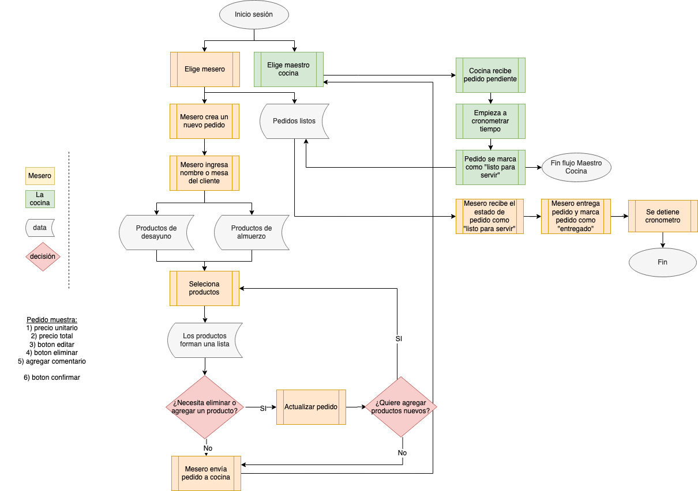

# SCL012BurgerQueen

## Objetivo del proyecto

## Flujo

## Historias de usuario

## Diseño

### Prototipo de baja fidelidad

### Prototipo de alta fidelidad

## Test de usabilidad

## Planificación

